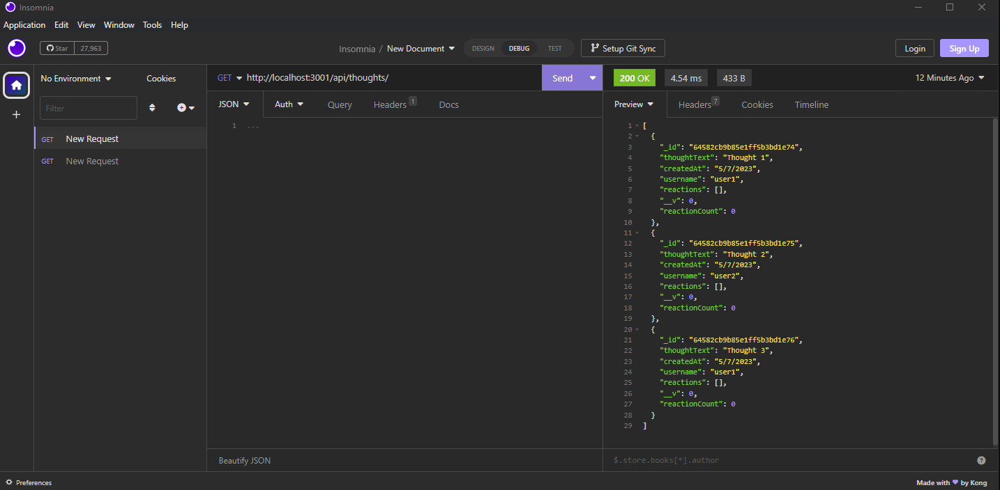

# Social Network API

## Description

This is a backend application that can be used to create Users, Thoughts, and Reactions to those thoughts through MongoDB using Mongoose.

## Technologies Used

This application is built using JavaScript, Exress, Node, MongoDB, and Mongoose.

## Application Links and Demo Videos

GitHub Repo: https://github.com/wobbledy/social-network-api

Demo Video #1: https://drive.google.com/file/d/1SF5RbaP2Beexcej877rKUVZvQpvoDaWy/view

Demo Video #2: https://drive.google.com/file/d/1u64v1FAiBelTrbPD6H3fQRBXea-PvKFU/view

## Application Screenshot

